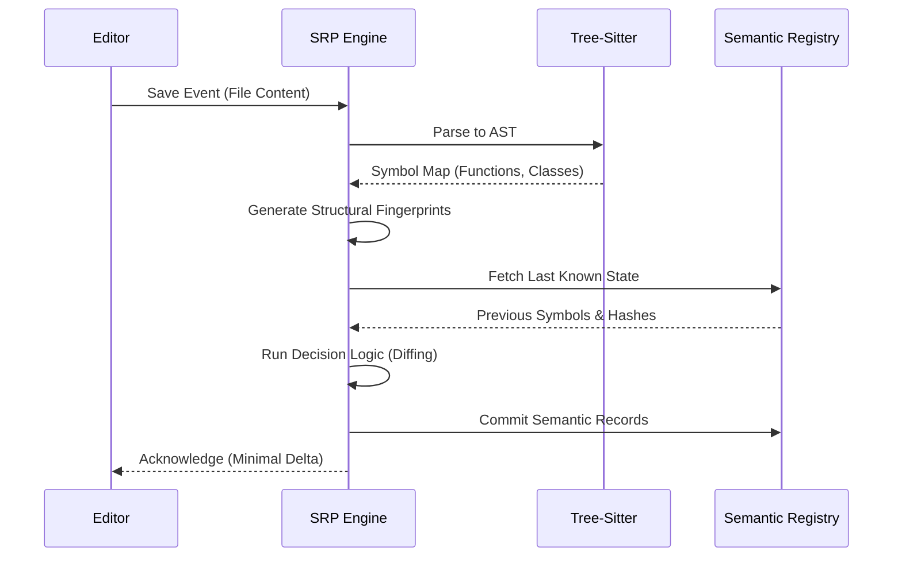

<div align="center">

# 🌲 Semantic Registry Protocol (SRP)

**Understand code, not just lines. A universal standard for minimal, structural code persistence.**

[](https://www.rust-lang.org)
[](#srcprotocolrs)
[](https://tree-sitter.github.io/tree-sitter/)
[](LICENSE)

---

[Explore Features](#why-srp) • [Architecture](#technical-architecture) • [The Lifecycle of a Save](#the-lifecycle-of-a-save) • [Supported Languages](#supported-languages) • [Getting Started](#getting-started)

</div>

## Overview

The **Semantic Registry Protocol (SRP)** is a high-performance framework designed to replace traditional local history and file-based versioning with a minimal, secure, and structural approach. While IDEs like VSCode or IntelliJ save full copies of files, SRP understands the **structural evolution** of your code at every save.

By leveraging **Tree-Sitter** and **FastCDC**, SRP provides:
- **Structural Persistence**: Versioning symbols, not lines.
- **Deduplication**: Storing only what actually changed logically.
- **Refactoring Intelligence**: Native detection of renames and moves.
- **Registry Alignment**: A single source of truth for every function, class, and method.

---

## Technical Architecture

### 1. The Lifecycle of a Save

When a file is saved, SRP triggers a high-speed pipeline to determine the "Semantic Delta" between the current buffer and the Registry.



### 2. Structural Fingerprinting
To distinguish between "cosmetic" and "logical" changes, SRP uses a custom **Structural Fingerprinter**. 

- **Normalization**: During AST traversal, SRP ignores variable names, comments, and literal values.
- **The Identity**: It hashes the **structure** (loops, branches, call patterns).
- **Benefit**: Changing a variable name from `i` to `index` does **not** trigger a "Modified" record. The logic remains identical.

---

## The Decision Engine (Diff Logic)

The `SemanticDiffer` doesn't just look at bytes. It follows a rigorous logical flow to categorize every change into **Semantic Records**:

| Change Type | Detection Logic | Result |
| :--- | :--- | :--- |
| **Identical** | Name matches AND Structural Hash matches. | **Ignored**. No storage overhead. |
| **Modified** | Name matches BUT Structural Hash is different. | **Modified Record**. Only the new logic is stored. |
| **Renamed** | Name is missing, but a new symbol has the SAME Structural Hash. | **Renamed Record**. Tracks the evolution across identities. |
| **Added** | New Name AND New Structural Hash found. | **Added Record**. |
| **Deleted** | Name is gone AND no structural match found in new symbols. | **Deleted Record**. |

---

## Storage: Hybrid Semantic-CDC Chunking

SRP solves the "Local History Bloat" problem by using a hybrid approach to save data:

1.  **Semantic Alignment**: SRP attempts to align chunk boundaries with AST nodes (e.g., one chunk = one function).
2.  **Deduplication**: If a function hasn't changed logically, its chunk is reused. The Registry only stores a lightweight reference.
3.  **FastCDC Fallback**: For massive nodes or unsupported languages, it falls back to *Content-Defined Chunking*, ensuring that a small change in a huge file only invalidates a tiny fraction of the data.

---

## Why SRP?

| Feature | IDE Local History | Semantic Registry Protocol |
|---------|-------------------|----------------------------|
| **Granularity** | Entire File (Text) | Symbol-based (AST) |
| **Storage** | Heavy (full copies) | Ultra-Minimal (Semantic Records) |
| **Renames** | Shown as Delete + Add | Detected as `Renamed` |
| **Noise** | Diffs on comments/variable names | Ignores cosmetic changes |
| **Reliability** | Line-based | Logic-aware (Safe at every save) |

---

## Core Components

- **`src/semantic/`**: 
    - `parser.rs`: Orchestrates Tree-Sitter parsing.
    - `fingerprint.rs`: The Structural Hashing engine.
    - `diff.rs`: The Decision Logic for record generation.
    - `chunker.rs`: The Hybrid Semantic-CDC implementation.
- **`src/protocol.rs`**: JSON-RPC standard for SRP communication.
- **`src/models.rs`**: Definitions for `SemanticRecord`, `SemanticSymbol`, and `RecordKind`.

---

## Supported Languages

SRP is designed for the modern polyglot environment:
- **Systems**: Rust, Go, C, C++, C#
- **Web**: JavaScript, TypeScript, HTML, CSS, PHP
- **Data/Script**: Python, Ruby, JSON
- **Docs**: Markdown

---

## Getting Started

### Installation
```bash
cargo build --release
```

### Usage (Library)
```rust
use semantic_registry_protocol::semantic::SemanticParser;

let mut parser = SemanticParser::new()?;
// Analyze code and get structural records
let symbols = parser.parse_symbols(content, "rs", 1, Some("main.rs"))?;
```

## License
This project is licensed under the MIT License - see the [LICENSE](LICENSE) file for details.
